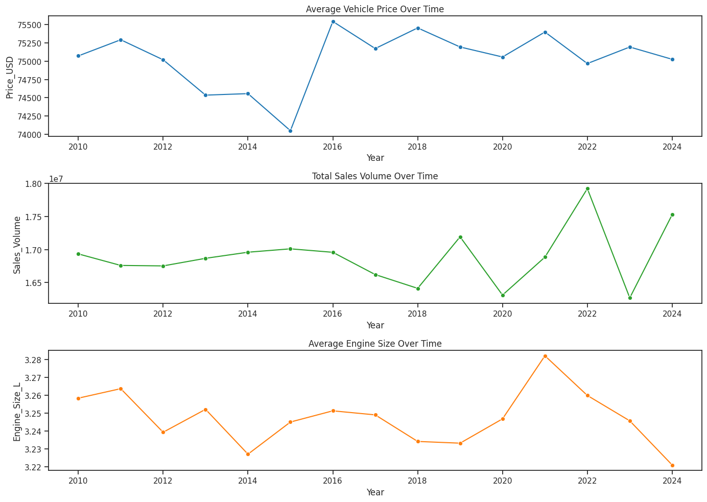

# 📊 BMW Sales Data Analysis (2010–2024)

## 📌 Project Overview
This project presents an exploratory data analysis (EDA) and data visualization of BMW sales data from 2010 to 2024.  
The analysis aims to uncover sales trends, pricing patterns, regional performance, and relationships between vehicle specifications and sales volume using Python.

This project is created as a portfolio to demonstrate practical data analysis and visualization skills.

---

## 📂 Dataset Description
The dataset contains historical BMW sales records with the following attributes:

- **Model** – BMW vehicle model  
- **Year** – Production or sales year  
- **Region** – Sales region  
- **Color** – Vehicle color  
- **Fuel_Type** – Type of fuel used  
- **Transmission** – Transmission type  
- **Engine_Size_L** – Engine size in liters  
- **Mileage_KM** – Vehicle mileage in kilometers  
- **Price_USD** – Vehicle price in USD  
- **Sales_Volume** – Number of units sold  
- **Sales_Classification** – Sales performance category  

---

## 🎯 Objectives
- Analyze sales performance trends over time  
- Identify top-performing models and regions  
- Understand how price, engine size, and mileage affect sales volume  
- Explore customer and market preferences  
- Create clear and insightful visualizations for business analysis  

---

## 🛠️ Tools & Technologies
- Python  
- Pandas & NumPy  
- Matplotlib & Seaborn  
- Google Colab  

---

## 🔍 Analysis Workflow
1. Data loading and inspection  
2. Data cleaning and preprocessing  
3. Feature engineering (engine size categorization)  
4. Exploratory data analysis (EDA)  
5. Relationship and correlation analysis  
6. Time-series trend analysis  
7. Regional sales performance analysis  

---

## 📈 Key Insights
- Certain BMW models consistently generate higher sales volume.  
- Larger engine sizes are associated with higher vehicle prices.  
- Vehicle mileage shows a negative relationship with price.  
- Sales performance varies significantly across regions.  
- Recent years indicate a trend toward more efficient engine sizes.  

---

## 🚀 How to Run
1. Open the notebook using Google Colab  
2. Upload the dataset file:  
   `BMW sales data (2010-2024).csv`  
3. Run all cells sequentially  

---

## 🔮 Future Enhancements
- Develop an interactive dashboard  
- Apply machine learning models for sales classification  
- Implement sales forecasting models  
- Deploy analysis using Streamlit or Plotly Dash  

---

## 📊 Visualization Results

### 📈 Sales Trends & Vehicle Characteristics (2010–2024)

### 🌍 Total Sales Volume by Region

## 📊 Project Output & Insights

### 📈 Sales Trend Analysis (2010–2024)
- BMW sales volume shows **yearly fluctuations** with several peak and decline periods.
- Despite temporary downturns, the overall trend indicates **market recovery and resilience**.
- Sales trends highlight the importance of **long-term planning and forecasting**.

---

### 💰 Price & Engine Size Relationship
- Vehicles with **larger engine sizes tend to have higher prices**.
- Higher-priced vehicles generally record **lower sales volume**, indicating a premium market segment.
- Medium engine sizes offer the **best balance between price and demand**.

---

### 📉 Mileage Impact on Price
- A **negative correlation** is observed between vehicle mileage and price.
- Higher mileage vehicles experience **consistent price depreciation**.

---

### 🌍 Regional Sales Performance
- Sales distribution varies across regions, with **some regions contributing more significantly** to total sales volume.
- Regional differences indicate **market preference and growth opportunities**.

---

### ⚙️ Engine Size Trend Over Time
- Average engine size shows a **gradual decrease in recent years**.
- This trend suggests a shift toward **fuel efficiency and compliance with emission regulations**.

---

### 🧠 Business Value
This project provides actionable insights that can be used for:
- Sales forecasting and strategic planning  
- Product positioning and pricing strategy  
- Regional market optimization  
- Understanding customer preferences and market trends  

---

### 📌 Summary
> *This analysis transforms raw BMW sales data into meaningful insights, supporting data-driven decision-making in sales strategy, pricing, and market planning.*

